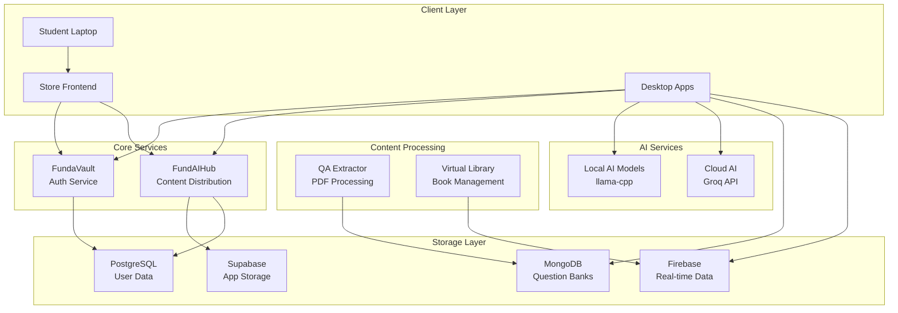
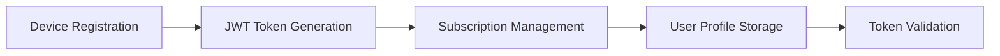
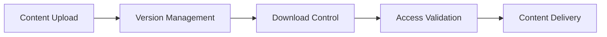
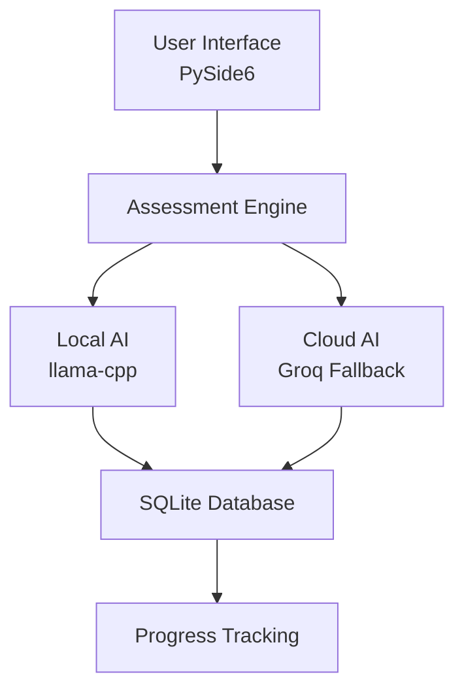
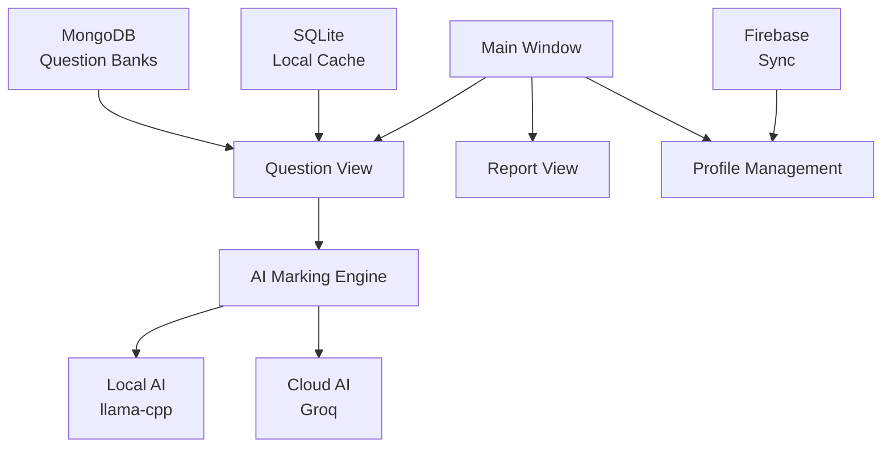
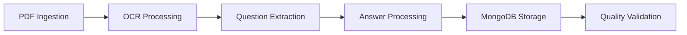
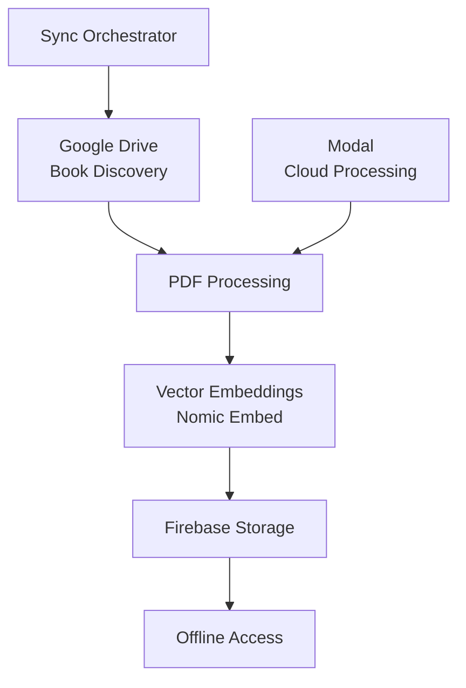
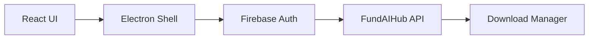
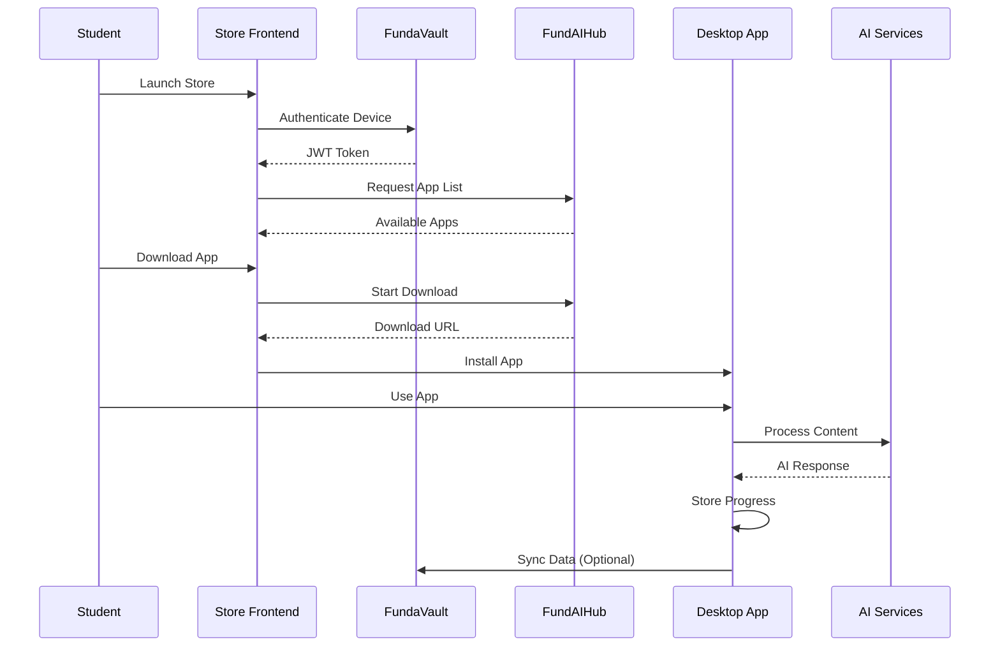
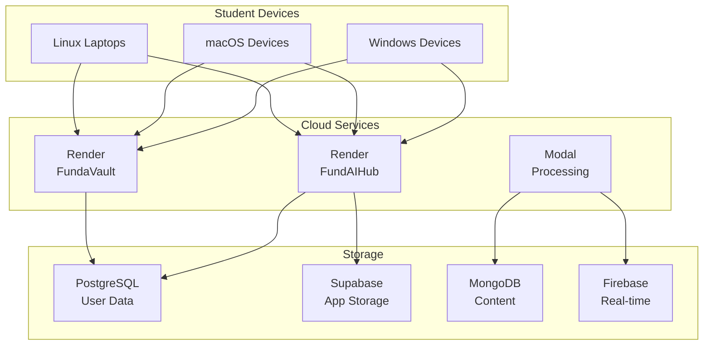

# FundaAI Repository Architecture

## Executive Summary

FundaAI is a comprehensive AI-powered educational ecosystem designed to provide offline-capable learning tools for students across Africa. The repository is structured as a monorepo containing multiple interconnected services that work together to deliver personalized, AI-driven educational experiences.

## System Overview

The FundaAI ecosystem consists of several key components:

1. **Authentication & User Management** (FundaVault)
2. **Content Distribution** (FundAIHub)
3. **Desktop Applications** (The Engineer, The Examiner)
4. **Content Processing** (QA Extractor, Virtual Library)
5. **Frontend Store** (Electron-based Store)

## High-Level Architecture

## Service Breakdown

### 1. FundaVault (Authentication Service)
**Technology**: Python/FastAPI, PostgreSQL
**Purpose**: Central authentication and user management

**Key Features**:
- Device-based authentication
- Subscription tracking (30-day cycles)
- JWT token generation and validation
- User profile management
- Admin operations

### 2. FundAIHub (Content Distribution)
**Technology**: Go, PostgreSQL, Supabase
**Purpose**: App store and content distribution

**Key Features**:
- App store management
- Download control and tracking
- Content versioning
- Subscription-based access control
- Integration with FundaVault for authentication

### 3. The Engineer (Desktop App)
**Technology**: Python/PySide6, SQLite, Local AI
**Purpose**: Engineering thinking assessment for ages 12-18

**Key Features**:
- Engineering thinking assessment
- Local AI processing with cloud fallback
- Kid-friendly interface
- Offline capability
- Progress tracking

### 4. The Examiner (Desktop App)
**Technology**: Python/PySide6, SQLite, MongoDB, Firebase
**Purpose**: Comprehensive exam preparation platform

**Key Features**:
- Comprehensive exam preparation
- AI-powered answer evaluation
- Multi-subject support
- Offline-first with cloud sync
- Detailed performance analytics

### 5. QA Extractor (Content Processing)
**Technology**: Python, Dagger, MongoDB
**Purpose**: Automated extraction of questions and answers from PDFs

**Key Features**:
- Automated PDF processing
- Question and answer extraction
- AI-powered content analysis
- MongoDB storage
- Quality validation

### 6. Virtual Library (Book Management)
**Technology**: Python, Firebase, Google Drive, Modal
**Purpose**: AI-powered book processing and management

**Key Features**:
- Automated book discovery
- Vector embedding generation
- Firebase integration
- Cloud processing via Modal
- Offline access management

### 7. Store Frontend (Electron App)
**Technology**: React, TypeScript, Electron, Firebase
**Purpose**: Desktop store interface for app discovery and management

**Key Features**:
- Cross-platform desktop app
- App discovery and browsing
- Download management
- User authentication
- Admin dashboard

## Data Flow Architecture

## Integration Points

### Authentication Flow
1. **Device Registration**: Devices register with FundaVault
2. **Token Generation**: FundaVault generates JWT tokens with subscription data
3. **Content Access**: FundAIHub validates tokens for content access
4. **Local Validation**: Desktop apps can validate tokens locally

### Content Distribution Flow
1. **Content Upload**: Admins upload apps to FundAIHub
2. **Version Management**: FundAIHub manages app versions
3. **Download Control**: Subscription-based download access
4. **Local Installation**: Apps install locally on student devices

### AI Processing Flow
1. **Local Processing**: Desktop apps use local AI models when available
2. **Cloud Fallback**: Cloud AI (Groq) used when local AI unavailable
3. **Hybrid Approach**: Intelligent routing based on complexity and availability

## Technology Stack Summary

| Service | Language | Framework | Database | AI | Deployment |
|---------|----------|-----------|----------|----|-----------| 
| FundaVault | Python | FastAPI | PostgreSQL | - | Render |
| FundAIHub | Go | HTTP Server | PostgreSQL | - | Render |
| The Engineer | Python | PySide6 | SQLite | llama-cpp/Groq | Local |
| The Examiner | Python | PySide6 | SQLite/MongoDB | llama-cpp/Groq | Local |
| QA Extractor | Python | Dagger | MongoDB | LLM APIs | Modal |
| Virtual Library | Python | - | Firebase | Nomic Embed | Modal |
| Store Frontend | TypeScript | React/Electron | Firebase | - | Local |

## Key Architectural Principles

### 1. Offline-First Design
- Desktop apps work without internet connection
- Local AI models for privacy and performance
- Local data storage with optional cloud sync

### 2. Microservice Architecture
- Loosely coupled services
- Independent deployment and scaling
- Clear service boundaries

### 3. Security by Design
- Device-based authentication
- JWT tokens with subscription data
- Local validation capabilities
- Minimal data collection

### 4. Educational Focus
- Age-appropriate interfaces
- Progressive difficulty
- Comprehensive progress tracking
- Multi-subject support

## Deployment Architecture

## Future Roadmap

### Short-term (3 months)
- Complete QA Extractor integration
- Enhanced Virtual Library features
- Improved offline synchronization

### Medium-term (6 months)
- Mobile companion apps
- Advanced analytics dashboard
- Multi-language support

### Long-term (12 months)
- Collaborative learning features
- Advanced AI tutoring
- Expanded subject coverage

---

